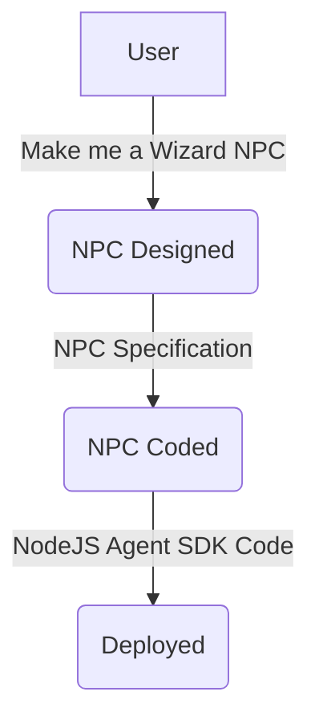

# About

Make it super easy to make a new NPC that can bring UpStreet to life.

Using 2 connect AI Agents we can output complex NPC's with certain abilities and skillsets.

## Agents Involved

1. [Description Generator](https://github.com/vinny-888/upstreet-map/wiki/NPC-Description-Generator-AI-Agent)
2. [UpStreet Agent SDK Codewriter](https://github.com/vinny-888/upstreet-map/wiki/UpStreet-AI-Agent-SDK-Creator-AI)
3. [Generating NPC code with 1 sentence](https://github.com/vinny-888/upstreet-map/wiki/Making-AI-Agents)

## Agent Graph

## Results
- [Witch](https://github.com/vinny-888/upstreet-map/wiki/Scary-Witch)
- [Quizmaster](https://github.com/vinny-888/upstreet-map/wiki/Generating-an-NPC-Quest-Master)
- [Wizard](https://github.com/vinny-888/upstreet-map/wiki/Making-AI-Agents)
