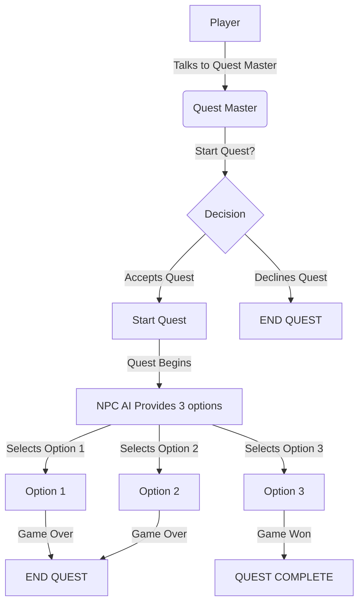

## Simple Example

```mermaid
graph TD;
    A[Player] -->|Talks to Quest Master| B(Quest Master)
    B --> |Start Quest?| C{Decision}
    C -->|Accepts Quest| D[Start Quest]
    C -->|Declines Quest| E[END QUEST]
    D --> |Quest Begins| F[NPC AI Provides 3 options]
    F --> |Selects Option 1| G[Option 1] 
    F --> |Selects Option 2| H[Option 2]
    F --> |Selects Option 3| I[Option 3]
    G --> |Game Over| J[END QUEST]
    H --> |Game Over| J[END QUEST]
    I --> |Game Won| K[QUEST COMPLETE]
```